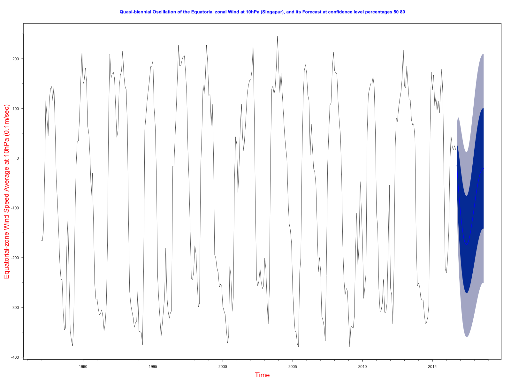

# Purpose

Trying in R (`forecast` library) an ARIMA (Auto-Regressive Integrated Moving Average) model on the Quasi-Biennial Equatorial Wind Oscillation time series.

This is related to the project [https://github.com/je-nunez/Quasi-Biennial-Oscillation](https://github.com/je-nunez/Quasi-Biennial-Oscillation), but this one is smaller than that in Spark/Scala. 

(This latter needs the Cloudera's `Time Series for Spark` library at [http://sryza.github.io/spark-timeseries/0.3.0/scaladocs/index.html#package](http://sryza.github.io/spark-timeseries/0.3.0/scaladocs/index.html#package), which also offers ARIMA models on timeseries. -- Maven: [https://maven-repository.com/artifact/com.cloudera.sparkts/sparkts/0.4.0](https://maven-repository.com/artifact/com.cloudera.sparkts/sparkts/0.4.0)).

# WIP

This project is a *work in progress*. The implementation is *incomplete* and subject to change. The documentation can be inaccurate.

# Example:

This R program generates an image, `arima_quasi_biennal_oscillation_at_10_hPa.png`, with the ARIMA forecast for the quasi-biennial oscillation of the Equatorial zonal wind at 10hPa (Singapur). It also prints some statistics about the ARIMA model, and Ljung-Box tests statistics.

